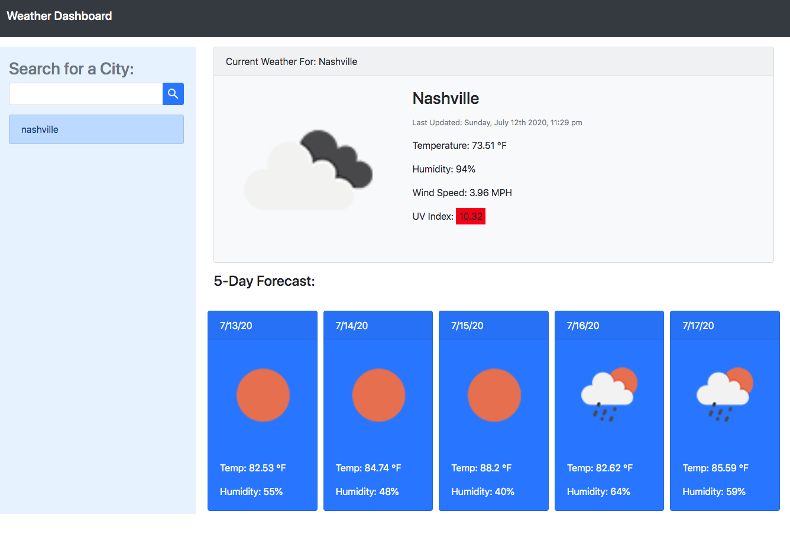
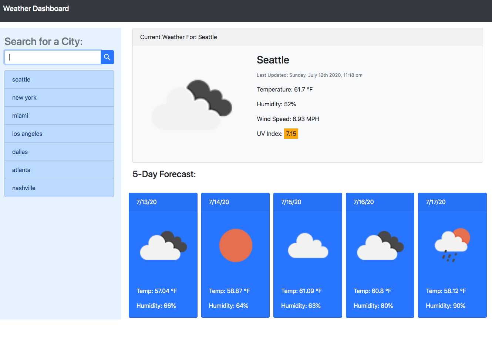

# Weather Dashboard

## Purpose
A simple weather dashboard for finding the current and five-day forecast for a given city

* User can search for weather by city
* Open Weather API reports back the current weather as well as five-day forecast
* The UV index background color changes based on the index value
* User searches are saved and persist in local storage
* Invalid or blank city searches produce and error message

## Built With
* HTML
* CSS
* Bootstap
* JavaScript
* jQuery
* Popper
* Moment.js
* Font Awesome
* Google Fonts
* Open Weather API

## Website
https://taylornyquist.github.io/weather-dashboard/

## Screen Shots and Video

[Video of Webpage](https://drive.google.com/file/d/12Uq9Jbyk5ILKmz6zcAKK7OT0KnqQRV0T/view)

 ## Responsiveness
* Boostrap Grid

 ## Known Issues/Future Enhancements
* Future feature could include geolocating users city
* Previously searched cities appear in all lowercase, future enhancement could have uppercase first letter of word in city name
* App could be more responsive to differing screen sizes

### Contribution
Made with ❤️ by Taylor Nyquist